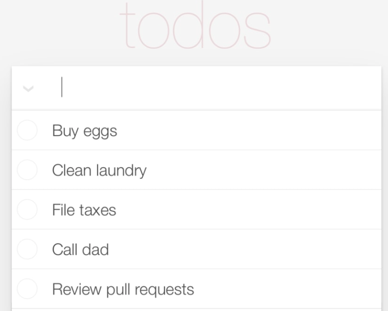
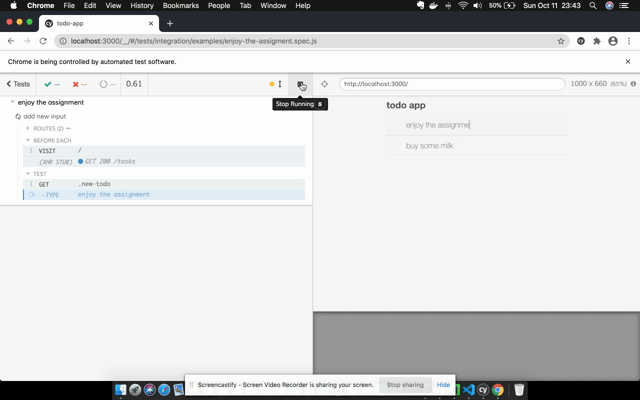

# Todos

 


[](https://travis-ci.com/bilalislam/todo-app-ui)


Todo application is a frontend project developed with react. With this application, no more forgetting :) List, plan and organize your life.


# Demo-Preview

As seen in the demo, Actually the operation of the cypress js tool is taken. Below we will give a reference about cypress but shortly a-tdd (acceptance test driven development) is a js tool used for. You can run your e2e tests with this tool.



Runs the app in the production mode.<br />
Open [http://a2d25b122e7e748b1a9e783974678ff0-651447118.eu-west-1.elb.amazonaws.com:5000/](http://http://a2d25b122e7e748b1a9e783974678ff0-651447118.eu-west-1.elb.amazonaws.com:5000/) to view it in the browser.

# Table of contents

Generally, If we take a look at the document, you can follow the table of contents below.

- [Todos](#todos)
- [Demo-Preview](#demo-preview)
- [Table of contents](#table-of-contents)
- [Installation](#installation)
- [Usage](#usage)
- [Deployment](#deployment)
- [Known Issues](#known-issues)
- [Architecure](#architecure)
- [References](#references)

# Installation
[(Back to top)](#table-of-contents)

To use this project, first clone the repo on your device using the command below:

```git init```

```git clone https://github.com/bilalislam/todo-app-ui```


# Usage
[(Back to top)](#table-of-contents)

### `npm install`

before start run npm install command on cli for download dependencies.


```sh
$ cd todo-app-ui 
$ npm install
```

### `yarn start`

```js
$ yarn start
```

Runs the app in the development mode.<br />
Open [http://localhost:3000](http://localhost:3000) to view it in the browser.

The page will reload if you make edits.<br />
You will also see any lint errors in the console.

### `yarn test`

```js
$ yarn test
```

Launches the test runner in the interactive watch mode.<br />

### `yarn build`

Builds the app for production to the `build` folder.<br />
It correctly bundles React in production mode and optimizes the build for the best performance.

The build is minified and the filenames include the hashes.<br />
Your app is ready to be deployed!

use below commands;

```js
$ yarn build
$ yarn global add serve
$ serve -s build
```

and will open port as 5000


### `yarn cypress`

```js
$ yarn cypress
```

### `for local acceptance test`

```js
$ npm start
$ npx cypress run
```

The a-tdd (acceptance test) page will reload if you run this command.<br />
You will also see all accepted tests

# Deployment

[(Back to top)](#table-of-contents)

### `docker compose for local build`

Compose is a tool for defining and running multi-container Docker applications. With Compose, you use a YAML file to configure your application’s services. Then, with a single command, you create and start all the services from your configuration. To learn more about all the features of Compose, [see the list of features ](https://docs.docker.com/compose/#features)

A docker-compose.yml looks like:

```docker

version: '3'

services:
  web:
    image: ninjafx/todo-app-ui:latest
    ports:
      - "5000:5000"
    depends_on:
      - api

  api:
    image: ninjafx/todo-app-api:latest
    ports:
      - "8080:8080"

```

```sh
$ docker-compose up
```

Open [http://localhost:5000](http://localhost:5000) to view it in the browser.

### `kompose`

Kompose is a conversion tool for Docker Compose to container orchestrators such as Kubernetes.

We are going to create Kubernetes Deployments, Services  for your Dockerized application. 

If you need different kind of resources, use the 'kompose convert' and 'kubectl create -f' commands instead. 


```sh
$ kompose convert  -f docker-compose.yaml
or
$ kompose --file docker-compose.yml up 
```

### `aws eks`

Amazon Elastic Kubernetes Service (Amazon EKS) is a fully managed Kubernetes service.

Getting started with eksctl: This getting started guide helps you to install all of the required resources to get started with Amazon EKS using eksctl, a simple command line utility for creating and managing Kubernetes clusters on Amazon EKS. At the end of the tutorial, you will have a running Amazon EKS cluster that you can deploy applications to. This is the fastest and simplest way to get started with Amazon EKS.

simple usage ;

```sh
$ eksctl create cluster --name todo-app --nodes 1 --node-type t2.medium --region eu-west-1
```

After created our  cluster and we are ready for deployment with kubectl .

kubectl controls the Kubernetes cluster manager.

```sh
$ kubectl apply -f web-deployment.yaml
$ kubectl apply -f web-service.yaml
```

Open [http://ec2-ip:5000](http://ec2-ip:5000) to view it in the browser.

### `travis ci`

Or travis ci  all written the above things will run in .travis.yml. After commit,It will build  dockerfile and push the image to aws container service. But this ci/cd pipeline could not completed yet.


# Known Issues

[(Back to top)](#table-of-contents)

1. it could not include pact for mocking a-tdd not yet
2. it could not include a-tdd process in ci/cd pipeline not yet

# Architecure

[(Back to top)](#table-of-contents)

This project has been created with create-react-app template by facebook !
Open [create-react-app](https://github.com/facebook/create-react-app) to view it in the browser.

# References

[(Back to top)](#table-of-contents)

1. https://kompose.io/
2. https://eksctl.io/
3. https://drive.google.com/file/d/1slZgPh8yOvhGC_r4wQpvYC-OSDw1I__0/view
4. https://travis-ci.com/
5. https://www.cypress.io/
